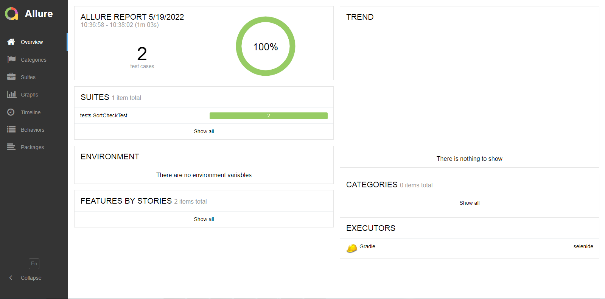
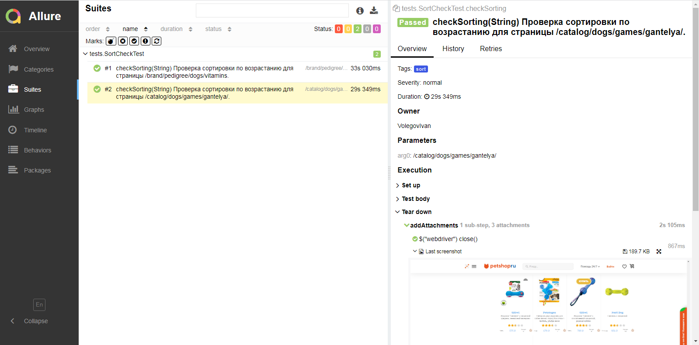

# Проект по автоматизации тестирования сайта "Petshop.ru"

## :floppy_disk: Содержание:

- <a href="#computer-технологии-и-инструменты">Технологии и инструменты</a>
- <a href="#notebook_with_decorative_cover-реализованные-проверки">Функционал и реализованные проверки</a>
- <a href="#open_book-allure-отчет">Allure отчет</a>

## :computer: Технологии и инструменты

## :notebook_with_decorative_cover: Реализованные проверки
- Проверка работы сортировки по возрастанию цены.
 

## :open_book: Allure отчет
- ### Главный экран отчета

- ### Страница с проведенными тестами

